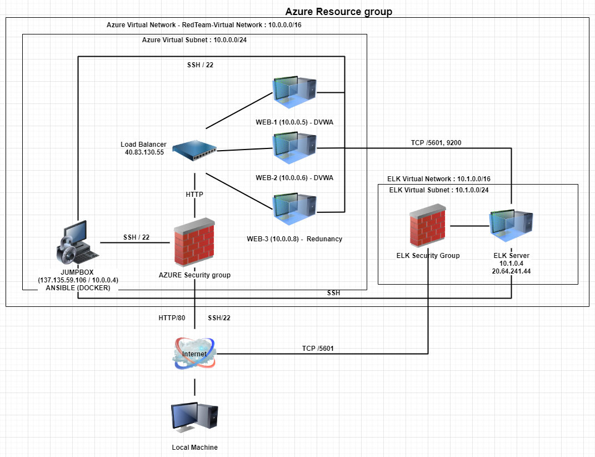

# Cybersecurity2021
This is Benedict's files for Cybersecurity Bootcamp 2021!
## Automated ELK Stack Deployment

The files in this repository were used to configure the network depicted below.

These files have been tested and used to generate a live ELK deployment on Azure. They can be used to either recreate the entire deployment pictured above. Alternatively, select portions of the _YML_ file may be used to install only certain pieces of it, such as Filebeat.

  - **File Name**: install-elk.yml

This document contains the following details:
- Description of the Topology
- Access Policies
- ELK Configuration
  - Beats in Use
  - Machines Being Monitored
- How to Use the Ansible Build

### Description of the Topology

The main purpose of this network is to expose a load-balanced and monitored instance of DVWA, the D*mn Vulnerable Web Application.

Load balancing ensures that the application will be highly availability, in addition to restricting access to the network.
- **What aspect of security do load balancers protect? What is the advantage of a jump box?**
 Load Balancers are effective in protecting the network from DDoS attacks as it reinforces the AVAILABILITY of the network. A jump box acts as a gateway to the other VM's hosted on the azure network. It adds an extra layer of security by blocking unauthorized access and mirrors what a DMZ might do in a network environment.

Integrating an ELK server allows users to easily monitor the vulnerable VMs for changes to the data and system logs.
- **What does Filebeat watch for?**
"Filebeat watches and monitors the log files or locations that you specify, collects log events, and forwards tem to Elasticsearch or Logstash for indexing" -_Reference_ [elastic](https://www.elastic.co/guide/en/beats/filebeat/current/filebeat-overview.html#:~:text=Filebeat%20is%20a%20lightweight%20shipper,Elasticsearch%20or%20Logstash%20for%20indexing).
- **What does Metricbeat record?**
"Metricbeat takes the metrics and statistics that it collects and ships them to the output that you specify, such as Elasticssearch or Logstash." - _Reference_ [elastic](https://www.elastic.co/guide/en/beats/metricbeat/current/metricbeat-overview.html#:~:text=Metricbeat%20is%20a%20lightweight%20shipper,such%20as%20Elasticsearch%20or%20Logstash).

The configuration details of each machine may be found below.
_Note: Use the [Markdown Table Generator](http://www.tablesgenerator.com/markdown_tables) to add/remove values from the table_.

| Name                 | Function         | IP Address              | Operating System |
|----------------------|------------------|-------------------------|------------------|
| Jump-Box-Provisioner |      Gateway     | 10.0.0.4/137.135.59.106 | Linux            |
|         Web-1        | WebServer / DVWA |         10.0.0.5        | Linux            |
|         Web-2        | WebServer / DVWA |         10.0.0.6        | Linux            |
|         Web-3        |    Redundancy    |         10.0.0.8        | Linux            |
| ELK-VirtualMachine   | ELK Server       | 10.1.0.4/20.64.241.44   | Linux            |

### Access Policies

The machines on the internal network are not exposed to the public Internet. 

Only the ELK machine can accept connections from the Internet. Access to this machine is only allowed from the following IP addresses:
- Home Public IP through TCP on Port 5601

Machines within the network can only be accessed by the Jumpbox.
_Which machine did you allow to access your ELK VM? What was its IP address?_ 
- Jumpbox: 10.0.0.4 / Port 22 
- Client : Public Home IP / Port 5601 (TCP)

A summary of the access policies in place can be found in the table below.

|         Name         | Publicly Accessible |      Allowed IP Addresses      |
|:--------------------:|:-------------------:|:------------------------------:|
| Jump-Box-Provisioner | No                  | Public IP via SSH on port 22   |
| Web-1                | No                  | 10.0.0.5 via SSH on port 22    |
| Web-2                | No                  | 10.0.0.6 via SSH on port 22    |
| Web-3                | No                  | 10.0.0.8 via SSH on port 22    |
| ELK-VirtualMachine   | No                  | Public IP via TCP on port 5601 |

### Elk Configuration

Ansible was used to automate configuration of the ELK machine. No configuration was performed manually, which is advantageous because...
_What is the main advantage of automating configuration with Ansible?_ 
- Using ansible saves alot of time as everything is autonomous. An operator can create a task summary in to file called a "playbook" and when this runs on a control machine, ansible uses SSH to communicate with hosts multiple hosts; reinforcing security during the operation.

The playbook implements the following tasks:
- _In 3-5 bullets, explain the steps of the ELK installation play. E.g., install Docker; download image; etc._

1. Docker.io, Python3-pip is installed using the apt module in linux.
2. Increase virtual memory using sysctl.
3. Download Docker container Image and configure with ports 9200:9200, 5601:5601 and 5044:5044 for Elasticsearch, Logstash and Kibana respectively. (ELK) 
4. Enable service docker on boot so that it starts automatically.

The following screenshot displays the result of running `docker ps` after successfully configuring the ELK instance.

### Target Machines & Beats
This ELK server is configured to monitor the following machines:

- Web-1 @ 10.0.0.5
- Web-2 @ 10.0.0.6
- Web-3 @ 10.0.0.8

We have installed the following Beats on these machines:

- ELK Server
- Web-1 @ 10.0.0.5
- Web-2 @ 10.0.0.6
- Web-3 @ 10.0.0.8
- _Specify which Beats you successfully installed_
- FileBeat and MetricBeat were installed.

These Beats allow us to collect the following information from each machine:
- _In 1-2 sentences, explain what kind of data each beat collects, and provide 1 example of what you expect to see. E.g., `Winlogbeat` collects Windows logs, which we use to track user logon events, etc._

- FileBeat; This is an agent that is installed on the machine that we want to monitor. It is used to centralize log data.
- MetricBeat; This is an agent that is used to collect metrics of the operating systems running on the designated servers. MetricBeat acts as the middleman and delivers the collected logs to a specified location, most commonly being Elasticsearch or Logstash.

### Using the Playbook
In order to use the playbook, you will need to have an Ansible control node already configured. Assuming you have such a control node provisioned: 

SSH into the control node and follow the steps below:
FILEBEAT
- Copy the file; https://gist.githubusercontent.com/slape/5cc350109583af6cbe577bbcc0710c93/raw/eca603b72586fbe148c11f9c87bf96a63cb25760/Filebeat >> /etc/ansible/roles/filebeat-config.yml.
- Update the filebeat-playbook.yml file to include curl -L -O https://artifacts.elastic.co/downloads/beats/filebeat/filebeat-7.6.1-amd64.deb
- Run the playbook, and navigate to _http://[VM-PUBLIC-IP]:5601/app/kibana#/home/tutorial/systemlogs_ > Click **Check data** at Step5  to check that the installation worked as expected.

METRICBEAT
- Copy the file; curl -L -O https://gist.githubusercontent.com/slape/58541585cc1886d2e26cd8be557ce04c/raw/0ce2c7e744c54513616966affb5e9d96f5e12f73/metricbeat >> /etc/ansible/roles/metricbeat-config.yml
- Update the filebeat-playbook.yml file to include curl -L -O https://artifacts.elastic.co/downloads/beats/metricbeat/metricbeat-7.6.1-amd64.deb
- Run the playbook, and navigate to _http://[VM-PUBLIC-IP]:5601/app/kibana#/home/tutorial/dockerMetrics_ > Click **Check data** at Step5  to check that the installation worked as expected.

_Answer the following questions to fill in the blanks:_
_Which file is the playbook? Where do you copy it?_
- FileBeat : filebeat-playbook.yml; Copy to /etc/filebeat/filebeat.yml
- MetricBeat : metricbeat-playbook.yml; Copy to /etc/metricbeat/metricbeat.yml

- _Which file do you update to make Ansible run the playbook on a specific machine? How do I specify which machine to install the ELK server on versus which to install Filebeat on?_
- The ansible configuration file (ansible.cfg) must be created; curl -L -O https://ansible.com/  > ansible.cfg
- Using any text editor such as nano, edit the /etc/ansible/hosts file to specify which machines
you want ELK installed on. Focus on _[webservers]_ and _[elk]_ to ensure the correct IP and interpreters
are in that section. 
For example, 
[webserver]
10.0.0.4 ansible_python_interpreter=/usr/bin/python3

- Run my_ansible.yml to execute these changes.

_Which URL do you navigate to in order to check that the ELK server is running?_
- http://[VM-PUBLIC-IP]:5601/app/kibana

_As a **Bonus**, provide the specific commands the user will need to run to download the playbook, update the files, etc._

- sudo docker start [container_name] && sudo docker attach [container_name]. This will start your container and allow you to SSH in to them.
- Run ansible-playbook [Playbook_Name].yml to execute the playbook.
- Use a text editor such as vim or nano to make changes to the [Hosts], [ansible.cfg] or
[YML] files; i.e nano [Playbook_name].yml
